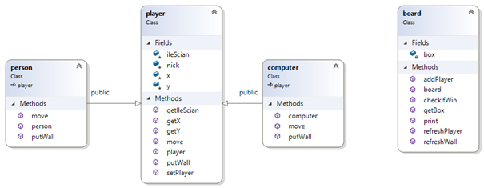

# Quoridor
by Jakub Mikula

 

<strong>List of options to choose from with a brief description of each</strong>

In the main menu:
1. Play against the computer.
2. Play against another player.
3. List of game endings based on the player's Nickname.*
4. Exit the entire program.

*Basic data validation is ensured.

In the game:
1. Move up/down/left/right.*
2. Place a wall (char for x, int for y).*
3. Return to the main menu.

*Basic data validation is ensured.

 
<strong>Known issues</strong>

During the placement of walls, the program does not check if a winning move is still possible (it's possible to completely block a player).

 
<strong>Inconsistencies with the assumptions provided in the task description</strong>

None.

 
<strong>Class diagram</strong>

